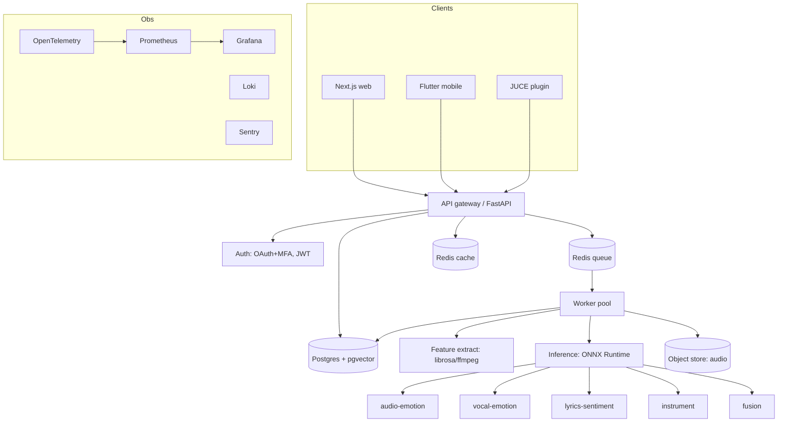

# SonicDNA — Architecture

## System



## Pipeline (analyze)
`upload → validate+scan → enqueue → decode(ffmpeg) → features(librosa) →
segment → embeddings → per-model inference(ONNX) → fusion → persist(DNA, timeline,
embedding) → notify`. Async (job id + webhook/WS), idempotent, retryable.

## Real-time / plugin
Plugin streams buffers → local lightweight ONNX (quantized) for **near-real-time**
DNA on a rolling window (target 100–300 ms), not 20 ms. Heavy analysis offloads
to backend. 20 ms live = research track, post-MVP.

## Stack
PyTorch (train) → **ONNX** (serve) · Librosa/FFmpeg · FastAPI · Postgres+pgvector ·
Redis · Next.js+Tailwind · Flutter · JUCE (VST3/AU/AAX) · AWS (ECS/Fargate, S3,
RDS, ElastiCache, CloudFront) · Terraform · GitHub Actions.

## Monorepo
```
sonicdna/
  apps/web/         Next.js + Tailwind
  apps/mobile/      Flutter
  plugin/           JUCE (VST3/AU/AAX)
  services/api/     FastAPI gateway
  services/worker/  analysis workers (FE + ONNX)
  packages/ml/      training, eval, ONNX export
  packages/dsp/     shared feature extraction
  packages/sdk/     TS + Dart API clients (generated)
  infra/            Terraform, Docker, CI
  data/             dataset prep + annotation pipeline
```

## Security
OAuth2 + MFA · JWT (short-lived) + refresh · TLS everywhere · upload validation
(type/size/duration) + ClamAV malware scan · per-key rate limits · signed S3 URLs ·
row-level tenant isolation · audit log · secrets in AWS SM.
